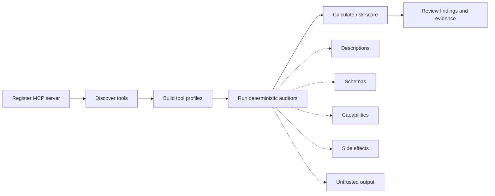
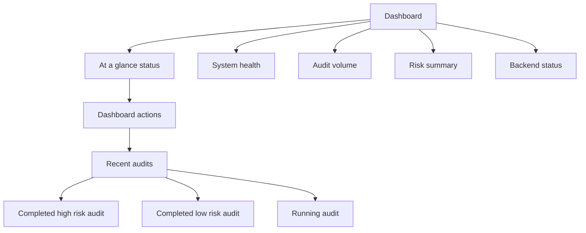
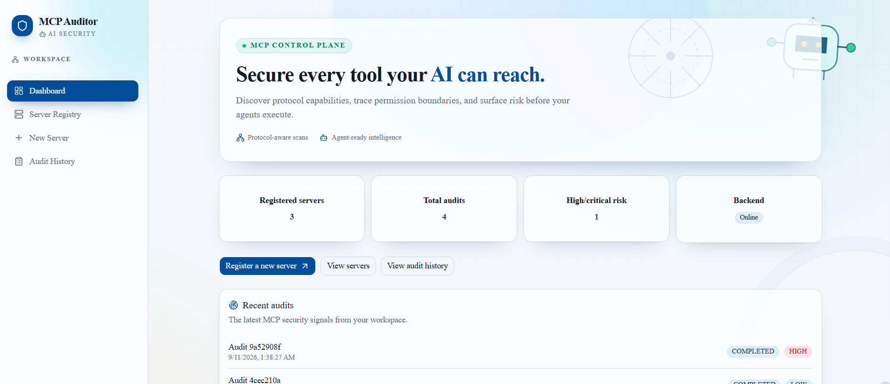
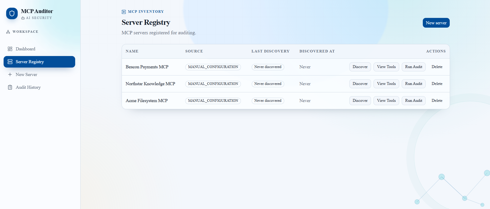
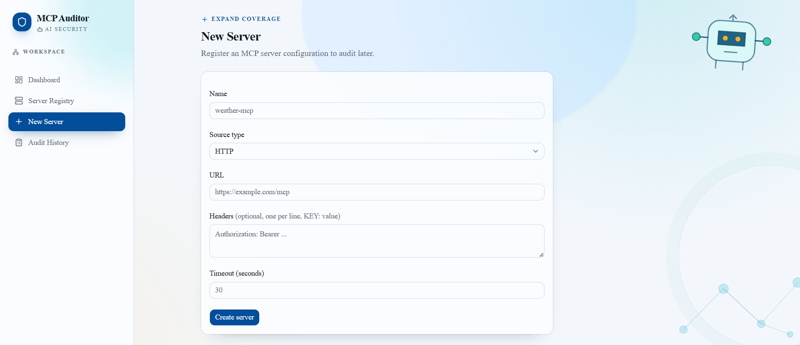
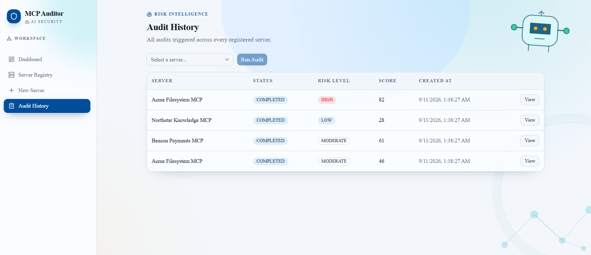

<div align="center">

<pre align="center">
       ███╗   ███╗ ██████╗██████╗      █████╗ ██╗   ██╗██████╗ ██╗████████╗ ██████╗ ██████╗
        ████╗ ████║██╔════╝██╔══██╗    ██╔══██╗██║   ██║██╔══██╗██║╚══██╔══╝██╔═══██╗██╔══██╗
        ██╔████╔██║██║     ██████╔╝    ███████║██║   ██║██║  ██║██║   ██║   ██║   ██║██████╔╝
        ██║╚██╔╝██║██║     ██╔═══╝     ██╔══██║██║   ██║██║  ██║██║   ██║   ██║   ██║██╔══██╗
        ██║ ╚═╝ ██║╚██████╗██║         ██║  ██║╚██████╔╝██████╔╝██║   ██║   ╚██████╔╝██║  ██║
        ╚═╝     ╚═╝ ╚═════╝╚═╝         ╚═╝  ╚═╝ ╚═════╝ ╚═════╝ ╚═╝   ╚═╝    ╚═════╝ ╚═╝  ╚═╝

┌──────────────────────────────────────────────────────────────────────┐
│                     MCP SERVER SECURITY SCANNER                      │
│                      [VERSION 0.1.0] [ONLINE]                        │
└──────────────────────────────────────────────────────────────────────┘
</pre>

**A deterministic security workbench for Model Context Protocol servers.**

[](./PROJECT_PLAN.md)
[](./backend/)
[](./frontend/)
[](#roadmap)

</div>

MCP Server Auditor inspects tool definitions and untrusted tool output for
misleading descriptions, prompt injection, excessive privilege, dangerous
capabilities, schema problems, and unexpected side effects. It produces a
structured report with evidence, severity, recommendations, and an explainable
risk score.

> **Build status:** The core platform is implemented and runnable: FastAPI
> backend, Next.js dashboard, asynchronous audit pipeline, reporting, and
> PostgreSQL/Redis infrastructure via Docker Compose.

## Signal Map

```text
      MCP SERVER  ──discover──>  TOOL PROFILES  ──audit──>  FINDINGS
                   │                          │                         │
                   └────────────── score <────┴──────── explain ────────┘

      [ descriptions ] [ schemas ] [ capabilities ] [ side effects ]
      [ prompt injection ] [ exfiltration ] [ authority spoofing ]
```

## Visual Preview

The product is organized around a small, explainable audit loop:



The first dashboard view is intentionally compact: an operator can see system
health, audit volume, risk at a glance, and the latest audit results before
drilling into the Server Registry or a detailed report.



### Product Screens

Explore the main operator workflows. Select a screen
to open the full-resolution view.

<table>
  <tr>
    <td align="center" valign="top">
      <a href="frontend/public/assets/dashboard.png"></a><br />
      <strong>Dashboard</strong><br /><sub>System health, audit volume, and risk at a glance.</sub>
    </td>
    <td align="center" valign="top">
      <a href="frontend/public/assets/server_registry.png"></a><br />
      <strong>Server Registry</strong><br /><sub>Manage MCP servers available for auditing.</sub>
    </td>
    <td align="center" valign="top">
      <a href="frontend/public/assets/new_server.png"></a><br />
      <strong>Register a Server</strong><br /><sub>Configure an HTTP, local, or manual MCP source.</sub>
    </td>
    <td align="center" valign="top">
      <a href="frontend/public/assets/audit_history.png"></a><br />
      <strong>Audit History</strong><br /><sub>Review completed scans, findings, and risk levels.</sub>
    </td>
  </tr>
</table>

## Quick Links

- [Getting Started](#prerequisites)
- [Run the backend](#3-start-the-backend-fastapi)
- [Run the frontend](#4-start-the-frontend-nextjs)
- [API Endpoints](#api-endpoints)
- [Roadmap](#roadmap)

## Project Structure

```
backend/    FastAPI + SQLAlchemy + Alembic application
frontend/   Next.js + TypeScript + Tailwind + TanStack Query application
docker-compose.yml   PostgreSQL + Redis for local development
docker/mcp-sandbox/  Hardened image used for local-command MCP execution
```

## Prerequisites

- Python 3.12+
- Node.js 20+
- Docker Desktop (with WSL2 or Hyper-V backend enabled on Windows)

## 1. Configure environment variables

```powershell
Copy-Item .env.example .env
Copy-Item frontend\.env.example frontend\.env.local
```

The defaults match `docker-compose.yml` and work out of the box for local
development.

## 2. Start infrastructure (PostgreSQL + Redis)

```powershell
docker compose up -d
```

This starts:
- PostgreSQL on `localhost:5432` (db `mcp_auditor`, user/password `mcp`/`mcp`)
- Redis on `localhost:6379`

Verify both containers are healthy:

```powershell
docker compose ps
```

The default Compose invocation remains infrastructure-only for local
development. Production uses the separate `docker-compose.prod.yml` file.
Create a secret directory outside the repository containing files named
`api_key`, `encryption_key`, `database_url`, `redis_url`,
`postgres_password`, and `redis_password`. Set `SECRETS_DIR` to its absolute
path and configure `POSTGRES_USER`, `POSTGRES_DB`, `APP_IMAGE_TAG`,
`CORS_ORIGINS`, and `NEXT_PUBLIC_API_URL`, then run:

```powershell
docker compose -f docker-compose.prod.yml up --build -d
```

This starts a one-shot migration container, then health-gates the backend,
Celery worker, and standalone Next.js frontend. Application containers run
as non-root users with read-only filesystems, dropped capabilities, bounded
temporary storage, and `no-new-privileges`. Database and application ports
bind to `BIND_ADDRESS` (`127.0.0.1` by default); place an authenticated TLS
reverse proxy in front of externally reachable production deployments.

`NEXT_PUBLIC_API_URL` is a public browser build setting, not a secret.
Changing it requires rebuilding the frontend image. Inject all credentials
at container runtime through the deployment platform; never pass secrets as
Docker build arguments. The worker is intentionally not given the Docker
socket. Consequently, local-command MCP execution fails closed until a
separate restricted execution service is configured.

## 3. Start the backend (FastAPI)

```powershell
cd backend
python -m venv .venv          # first time only
.\.venv\Scripts\Activate.ps1
pip install -r requirements.txt   # first time only / after dependency changes

uvicorn app.main:app --reload --port 8000
```

The backend is now available at http://localhost:8000. Verify it's running:

```powershell
curl http://localhost:8000/health
```

Apply database migrations:

```powershell
alembic upgrade head
```

This creates the `mcp_servers` table used by the server registration API
(see [API Endpoints](#api-endpoints) below).

### Start the audit worker (Celery)

Triggering an audit (`POST /servers/{id}/audits`) enqueues a background job;
a separate worker process executes it asynchronously (requires Redis from
step 2 above):

```powershell
cd backend
.\.venv\Scripts\Activate.ps1
celery -A app.workers.celery_app worker --loglevel=info
```

Without a running worker, audits will stay `PENDING` forever - `GET
/audits/{id}` lets you poll for status. (Tests run Celery in "eager" mode
in-process, so they don't need a real worker or Redis; see
`backend/tests/conftest.py`.)

### Abuse protection limits

Protected API requests use the configured Redis instance for fixed-window
limits. The defaults are deliberately high enough for normal dashboard
polling, while bounding expensive work:

- `RATE_LIMIT_REQUESTS=120` requests per `RATE_LIMIT_WINDOW_SECONDS` (60)
  per client/API key.
- `RATE_LIMIT_DISCOVERIES=10` discovery attempts per window.
- `RATE_LIMIT_AUDITS=5` audit submissions per window.
- `RATE_LIMIT_REPORTS=30` report renders per window.
- `MAX_ACTIVE_AUDITS_PER_SERVER=1` queued or running audit per server.

Discovery and audit limits prevent repeated remote MCP work and unbounded
Celery queue growth. The report limit protects CPU-intensive HTML/PDF
rendering. When a limit is exceeded, the API returns `429 Too Many Requests`
with a `Retry-After` header. If Redis is unavailable, protected requests
fail closed with `503 Service Unavailable` rather than bypassing abuse
protection. Override these values through environment variables when
capacity or operational requirements differ.

### MCP execution isolation

`LOCAL_COMMAND` MCP servers are never launched directly by the auditor in
production. Each discovery runs in a disposable Docker container using the
image configured by `MCP_SANDBOX_IMAGE` (default:
`mcp-auditor-mcp-sandbox:latest`). The container has no network, no host
mounts, a read-only root filesystem, a bounded `/tmp`, dropped Linux
capabilities, `no-new-privileges`, and configured memory, CPU, PID, timeout,
and output limits. The image must contain the approved MCP command and its
dependencies; arbitrary host executables are not mounted into it.

Build the baseline image before using local-command discovery:

```powershell
docker build -t mcp-auditor-mcp-sandbox:latest docker\mcp-sandbox
```

If Docker or the configured sandbox image is unavailable, local-command
execution fails closed. Tests that use the repository's fake MCP process
explicitly inject the test-only subprocess backend and do not represent the
production isolation boundary.

### Run backend tests

```powershell
cd backend
.\.venv\Scripts\Activate.ps1
pytest
```

### Run backend formatting/linting

```powershell
cd backend
.\.venv\Scripts\Activate.ps1
ruff format .
ruff check . --fix
```

## Continuous Integration

GitHub Actions runs [.github/workflows/ci.yml](./.github/workflows/ci.yml)
for pull requests, pushes to `main`, and manual dispatches. The workflow
contains independent, cached jobs so failures are easy to identify and
unrelated checks can run in parallel:

- **Backend quality and unit tests:** installs the pinned
  `backend/requirements.txt`, checks Ruff formatting and linting, runs mypy
  against `backend/app`, and runs tests not marked `integration`.
- **Backend integration tests:** runs the tests marked `integration`,
  covering FastAPI/database boundaries and the real MCP stdio subprocess
  transport. Test dependencies remain self-contained, so CI does not start
  unnecessary service containers.
- **Frontend quality and build:** uses `npm ci` with
  `frontend/package-lock.json`, then runs ESLint, `tsc --noEmit`, and the
  optimized Next.js build.
- **Dependency security:** runs `pip-audit` against the pinned Python
  requirements and `npm audit --audit-level=high` against the frontend
  lockfile.

Python packages and npm downloads use the caches provided by
`actions/setup-python` and `actions/setup-node`. Concurrent runs for the
same branch are cancelled when superseded. Any formatting, lint, type,
test, build, or high-severity dependency audit failure fails CI; the
workflow performs no deployment.

## 4. Start the frontend (Next.js)

```powershell
cd frontend
npm install   # first time only / after dependency changes
npm run dev
```

The frontend is now available at http://localhost:3000 and displays a
dashboard with a live backend connectivity check.

### Run frontend lint

```powershell
cd frontend
npm run lint
```

## API Endpoints

### Health

- `GET /health` - liveness/readiness check for the API.

### Server registry

- `POST /servers` - register a new MCP server.
- `GET /servers` - list registered servers.
- `GET /servers/{server_id}` - fetch a single server record.
- `DELETE /servers/{server_id}` - remove a server registration.

### Discovery

- `POST /servers/{server_id}/discover` - connect to a registered server,
  discover tools, and persist the latest result.
- `GET /servers/{server_id}/tools` - return the most recently discovered
  tools without re-running discovery.

### Audits

- `POST /servers/{server_id}/audits` - enqueue an asynchronous audit run.
  Returns `202 Accepted`; poll `GET /audits/{audit_id}` for status.
- `GET /audits` - list audits, optionally filtered by `server_id`.
- `GET /audits/{audit_id}` - fetch audit status and score metadata.
- `GET /audits/{audit_id}/findings` - list findings for a completed audit.

### Reports

- `GET /audits/{audit_id}/report` - canonical JSON audit report.
- `GET /audits/{audit_id}/report/html` - HTML render of the same report.
- `GET /audits/{audit_id}/report/pdf` - PDF export of the same report.

> Notes: the discovery route returns a `status` field instead of failing the
> request for unreachable servers, while the audit trigger is asynchronous and
> intended to be polled until completion.

## Roadmap

See [PROJECT_PLAN.md](./PROJECT_PLAN.md) for the full phase-by-phase plan
(architecture, domain model, scoring system, coding standards, and Phase
0–9 breakdown with status). Phases are implemented incrementally; later
phases are not started until the current phase is confirmed complete.
